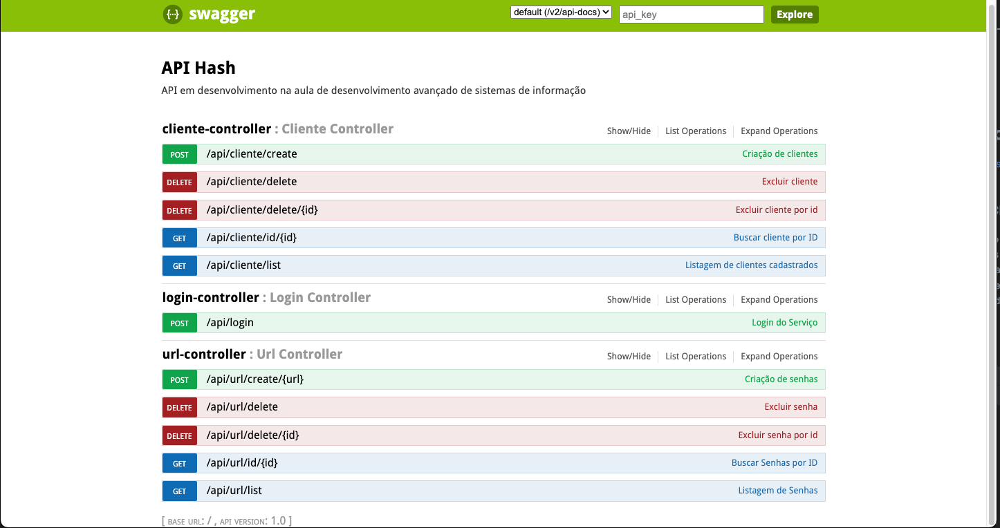

# API Hash

   

## Tópicos

  • <a href="#Descrição do Projeto">Criação de cliente</a> •
  <a href="#tecnicas-e-tecnologias-utilizadas">Consultas de cliente</a> •
  <a href="#abrir-e-rodar">Exclusão de cliente</a> •
  <a href="#acesso-ao-projeto">Criação de HASH</a> •  
  <a href="#ajustes-e-melhorias">Consultas de HASH</a> •
  <a href="#licenca">Exclusão de HASH</a> 

## Descrição do Projeto

Aplicação Java com SPRING BOOT, desenvolvida na aula de Desenvolvimento avançado de Sistemas de Informação da 4a etapa do curso de Sistemas de informação da Univem.

 * API gerando HASH a partir da URL informada

 * Balanceador de carga (Nginx)

 * Cache (spring-boot-starter-cache e Redis)

 * Banco de dados (H2)

## Próximos passos

  • <a href="#Descrição do Projeto">Migrar parra banco de dados MySql </a>•
  <a href="#tecnicas-e-tecnologias-utilizadas">Adicionar autenticação e proteção aos endpoints</a> •
  <a href="#abrir-e-rodar">Gerenciamento do cache</a> •
  <a href="#acesso-ao-projeto">Deploy na AWS</a> 

